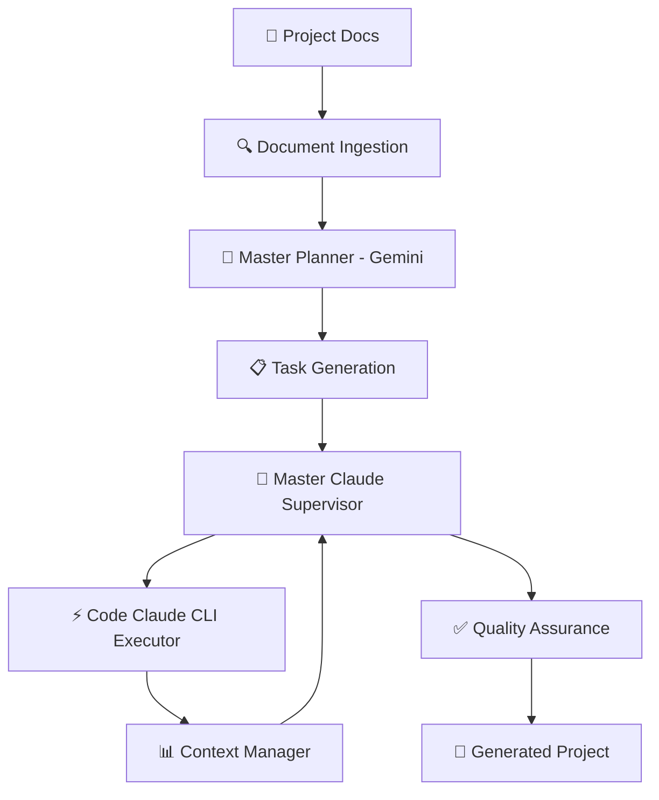

# 🤖 VIBE - Autonomous Coding Agent

<div align="center">


[](https://python.org)
[](https://claude.ai)
[](https://ai.google.dev)
[](LICENSE)

**Transform your project documentation into complete, production-ready software with AI**

[🚀 Quick Start](#-quick-start) • [📖 Documentation](#-documentation) • [🛠️ Features](#-features) • [🎯 Examples](#-examples)

</div>

---

## 📋 **Overview**

VIBE is an advanced autonomous coding agent that transforms project documentation into complete, production-ready software. Using a sophisticated **Master Claude + Code Claude** architecture, VIBE manages complex projects with intelligent supervision, context management, and automated quality assurance.

### 🌟 **Key Highlights**

- 🧠 **Intelligent Dual-AI Architecture** - Master Claude (Gemini) supervises Code Claude (Claude CLI) for optimal results
- 📚 **Multi-format Document Processing** - PDF, DOCX, Markdown, images, and UI mockups
- ⚡ **Context-Aware Execution** - 5 advanced compression strategies handle large-scale projects
- 🔄 **Dependency-Based Orchestration** - Smart task scheduling with parallel execution
- 💾 **Recovery & Persistence** - Checkpoint-based recovery with session continuity
- 📊 **Real-time Monitoring** - Live dashboard with execution insights

---

## 🚀 **Quick Start**

### Prerequisites
- Python 3.9+
- Claude CLI installed and configured
- API keys for Gemini and Claude

### Installation

```bash
# Clone the repository
git clone https://github.com/Vibers-ai/auto-vibe.git
cd auto-vibe

# Create and activate virtual environment
python -m venv venv

# Activate virtual environment
# On Windows:
venv\Scripts\activate
# On macOS/Linux:
source venv/bin/activate

# Install dependencies
pip install -r requirements.txt
```

### Setup

```bash
# Initialize a new project using module syntax
python -m src.cli init my-awesome-project
cd my-awesome-project

# Configure API keys (create .env file)
# Copy from parent directory:
cp ../.env.example .env

# Edit .env with your API keys:
# GEMINI_API_KEY=your_gemini_key_here
# ANTHROPIC_API_KEY=your_claude_key_here
```

### Generate Your First Project

```bash
# Add your project documentation to docs/ folder
# (PDFs, Word docs, images, markdown files)

# Generate complete software project
python -m src.cli generate

# Monitor progress (optional)
python -m src.cli monitor --mode web --port 8080

# Check status
python -m src.cli status

# Validate tasks (if needed)
python -m src.cli validate tasks.json
```

---

## 🏗️ **Architecture**

### Master Claude + Code Claude System



### Core Components

| Component | Technology | Purpose |
|-----------|------------|---------|
| **Master Claude** | Gemini 2.0 Flash | Project supervision, context management, architectural decisions |
| **Code Claude** | Claude 3.5 Sonnet CLI | Code generation, implementation, testing |
| **Context Manager** | Custom Algorithm | Intelligent compression with 5 strategies (128K token management) |
| **Task Orchestrator** | DAG-based Engine | Dependency resolution, parallel execution |
| **Recovery System** | SQLite + Checkpoints | Session persistence, failure recovery |
| **Monitor** | Rich + Web Dashboard | Real-time progress tracking |

---

## 🛠️ **Features**

### 📝 **Document Processing**
- **Multi-format Support**: PDF, DOCX, Markdown, Plain Text
- **Visual Analysis**: UI mockups and diagrams via Gemini Vision
- **Smart Synthesis**: Automatic ProjectBrief.md generation
- **Context Extraction**: Requirements, specifications, and constraints

### 🎯 **Intelligent Execution**
- **Architectural Planning**: Gemini-powered system design
- **Task Dependency Management**: Automated DAG-based scheduling
- **Parallel Processing**: Independent task execution
- **Context Compression**: 5 advanced strategies for large projects
  - `SUMMARIZE` - Smart completion summaries
  - `HIERARCHICAL` - Importance-based prioritization  
  - `SLIDING_WINDOW` - Recent context focus
  - `SEMANTIC_FILTERING` - Relevance-based filtering
  - `HYBRID` - Combined strategy optimization

### 🔧 **Code Generation**
- **Full-Stack Projects**: Frontend + Backend + Database
- **Framework Agnostic**: React, Vue, Node.js, Python, etc.
- **Best Practices**: Automated testing, linting, documentation
- **Quality Assurance**: Multi-layer validation and verification

### 🎛️ **Management & Monitoring**
- **Session Persistence**: Resume interrupted executions
- **Recovery System**: Automatic checkpoint-based recovery
- **Real-time Dashboard**: Web-based progress monitoring
- **CLI Tools**: Comprehensive command-line interface

---

## 🎯 **Examples**

### Example 1: E-commerce Platform

```bash
# Create project from business requirements document
python -m src.cli init ecommerce-platform
cd ecommerce-platform

# Add your docs/
# - business_requirements.pdf
# - ui_mockups.png
# - api_specifications.md

python -m src.cli generate
# ✅ Generates: React frontend, Node.js backend, PostgreSQL database, tests
```

### Example 2: Mobile App Backend

```bash
# Generate API backend from mobile app specs
python -m src.cli init mobile-api
cd mobile-api

# Add docs/mobile_app_spec.docx with API requirements
python -m src.cli generate --output-path ./backend

# ✅ Generates: FastAPI backend, authentication, database models, documentation
```

---

## 📖 **Documentation**

### CLI Commands

```bash
# Project Management
python -m src.cli init <project-name>              # Initialize new project
python -m src.cli generate                         # Generate project from docs
python -m src.cli validate tasks.json              # Validate task configuration

# Context Management  
python -m src.cli context stats --project my-app   # Show context statistics
python -m src.cli context compress --strategy hybrid # Force context compression
python -m src.cli context export --file knowledge.json # Export project knowledge

# Monitoring & Status
python -m src.cli monitor --mode web --port 8080   # Start web dashboard
python -m src.cli status --session session_id      # Check execution status

# Sample and Demo
python -m src.cli sample --output sample-tasks.json # Generate sample tasks
python -m src.cli demo-monitoring                   # Run monitoring demo
```

### Configuration

Create a `.env` file with your API keys:

```env
# Required API Keys
GEMINI_API_KEY=your_gemini_api_key_here
ANTHROPIC_API_KEY=your_claude_api_key_here

# Optional Configuration
GEMINI_MODEL=gemini-2.0-flash-exp
CLAUDE_MODEL=claude-3-5-sonnet-20241022
MAX_RETRIES=3
TASK_TIMEOUT=600
PARALLEL_TASKS=4
LOG_LEVEL=INFO
```

---

## 📁 **Project Structure**

```
auto-vibe/
├── src/
│   ├── shared/                    # Core shared modules
│   │   ├── agents/               # AI agent implementations
│   │   │   ├── context_manager.py        # Context compression & management
│   │   │   ├── document_ingestion.py     # Multi-format document processing
│   │   │   └── master_planner.py         # Gemini-based architecture planning
│   │   ├── core/                 # Core engine components
│   │   │   ├── schema.py                 # Task schema & validation
│   │   │   └── state_manager.py          # Execution state management
│   │   ├── monitoring/           # Real-time monitoring
│   │   │   ├── master_claude_monitor.py  # Rich-based terminal dashboard
│   │   │   └── web_dashboard.py          # Web-based monitoring
│   │   ├── tools/                # Agent-Computer Interface
│   │   │   └── aci_interface.py          # Tool abstraction layer
│   │   └── utils/                # Utility functions
│   │       ├── api_manager.py            # Rate limiting & retry logic
│   │       ├── config.py                 # Configuration management
│   │       ├── file_utils.py             # File system operations
│   │       └── recovery_manager.py       # Checkpoint & recovery system
│   └── cli/                      # CLI-specific implementation
│       ├── agents/               # CLI agent implementations
│       │   ├── claude_cli_executor.py    # Claude CLI subprocess management
│       │   └── master_claude_cli_supervisor.py # Master supervision logic
│       └── core/                 # CLI execution engine
│           └── executor_cli.py           # Main CLI task executor
├── tests/                        # Comprehensive test suite
├── docs/                         # Documentation (auto-generated)
└── requirements.txt              # Python dependencies
```

---

## 🤝 **Contributing**

We welcome contributions! Please see our [Contributing Guide](CONTRIBUTING.md) for details.

### Development Setup

```bash
# Clone and setup development environment
git clone https://github.com/Vibers-ai/auto-vibe.git
cd auto-vibe
pip install -r requirements.txt
pip install -e .

# Run tests
pytest tests/

# Run linting
flake8 src/
black src/
```

---

## 📄 **License**

This project is licensed under the MIT License - see the [LICENSE](LICENSE) file for details.

---

## 🙏 **Acknowledgments**

- **Anthropic** for Claude 3.5 Sonnet
- **Google** for Gemini 2.0 Flash  
- **Open Source Community** for inspiration and tools

---

<div align="center">

**Built with ❤️ by the VIBE Team**

[🌟 Star us on GitHub](https://github.com/Vibers-ai/auto-vibe) • [🐛 Report Issues](https://github.com/Vibers-ai/auto-vibe/issues) • [💬 Discussions](https://github.com/Vibers-ai/auto-vibe/discussions)

</div>