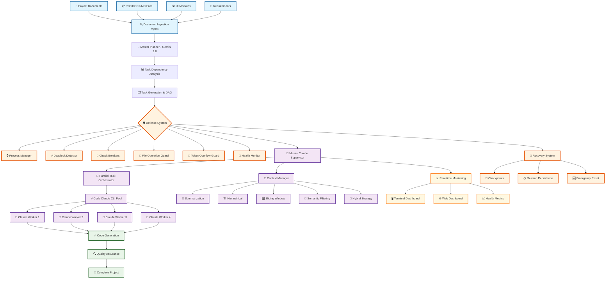

# 🤖 VIBE - Autonomous Coding Agent

<div align="center">


[](https://python.org)
[](https://claude.ai)
[](https://ai.google.dev)
[](LICENSE)

**Transform your project documentation into complete, production-ready software with AI**

[🚀 Quick Start](#-quick-start) • [📖 Documentation](#-documentation) • [🛠️ Features](#-features) • [🎯 Examples](#-examples)

</div>

---

## 📋 **Overview**

VIBE is an advanced autonomous coding agent that transforms project documentation into complete, production-ready software. Using a sophisticated **Master Claude + Code Claude** architecture with comprehensive defense systems, VIBE manages complex projects with intelligent supervision, context management, and automated quality assurance.

### 🎉 **Proven Test Results**

VIBE has been successfully tested to generate a complete CRUD bulletin board application:
- **Input**: Simple PRD document (Product Requirements Document)
- **Output**: 801+ files including full-stack application
- **Tasks Completed**: 16 automated tasks
- **Technologies Generated**: FastAPI backend, Vanilla JS frontend, SQLite database
- **Time**: ~5 minutes for complete project generation

### 🌟 **Key Highlights**

- 🧠 **Intelligent Dual-AI Architecture** - Master Claude (Gemini) supervises Code Claude (Claude CLI) for optimal results
- 📚 **Multi-format Document Processing** - PDF, DOCX, Markdown, images, and UI mockups
- ⚡ **Context-Aware Execution** - 5 advanced compression strategies handle large-scale projects
- 🔄 **Dependency-Based Orchestration** - Smart task scheduling with parallel execution
- 🛡️ **Comprehensive Defense Systems** - Process management, deadlock detection, circuit breakers
- 💾 **Recovery & Persistence** - Checkpoint-based recovery with session continuity
- 📊 **Real-time Monitoring** - Live dashboard with execution insights and health monitoring

---

## 🚀 **Quick Start**

### 🎯 Simple Example: Create a CRUD App in 5 Minutes

```bash
# 1. Clone and setup
git clone https://github.com/Vibers-ai/auto-vibe.git
cd auto-vibe
python3 -m venv venv && source venv/bin/activate
pip install -r requirements.txt

# 2. Configure API keys
cp .env.example .env
# Edit .env with your GEMINI_API_KEY and ANTHROPIC_API_KEY

# 3. Create a simple project
mkdir my-bulletin-board && cd my-bulletin-board

# 4. Write a simple PRD
echo "# Simple CRUD App
Create a bulletin board with:
- FastAPI backend
- SQLite database  
- Basic HTML/JS frontend
- CRUD operations for posts" > PRD.md

# 5. Generate the project
python ../src/cli.py generate --docs . --output output

# ✅ Done! Check output/ for your complete application
```

### Prerequisites

#### System Requirements
- **Python**: 3.9+ (tested with 3.12.3)
- **Operating System**: Linux, macOS, or Windows with WSL2
- **Memory**: 4GB+ RAM recommended
- **Storage**: 2GB+ free space

#### Required Tools
- **Claude CLI**: Must be installed and configured
- **Git**: For version control
- **Node.js/npm**: If using npx claude option

#### API Keys Required
- **Gemini API Key**: From [Google AI Studio](https://makersuite.google.com/)
- **Anthropic API Key**: For Claude access

### Installation

```bash
# Clone the repository
git clone https://github.com/Vibers-ai/auto-vibe.git
cd auto-vibe

# Create and activate virtual environment
python3 -m venv venv

# Activate virtual environment
# On Windows:
venv\Scripts\activate
# On macOS/Linux:
source venv/bin/activate

# Install dependencies
pip install -r requirements.txt

# Install the package in development mode (optional)
pip install -e .
```

### Claude CLI Setup

```bash
# Check if Claude CLI is available
claude --version

# Or if using npx:
npx claude --version

# Configure Claude CLI if needed
claude configure
```

### Setup

```bash
# Initialize a new project (use direct script execution)
python src/cli.py init my-awesome-project
cd my-awesome-project

# Configure API keys (create .env file)
# Copy from parent directory:
cp ../.env.example .env

# Edit .env with your API keys and configuration:
# GEMINI_API_KEY=your_gemini_key_here
# ANTHROPIC_API_KEY=your_claude_key_here
# 
# Optional configurations:
# PARALLEL_TASKS=4
# MAX_RETRIES=3
# TASK_TIMEOUT=600
# LOG_LEVEL=INFO
```

### Complete Project Setup and Execution

#### Step 1: Initialize Your Project
```bash
# Create a new VIBE project
python src/cli.py init my-awesome-project

# Navigate to your project directory
cd my-awesome-project

# Copy environment configuration template
cp ../.env.example .env

# Edit .env with your actual API keys
nano .env  # or use your preferred editor
```

#### Step 2: Configure API Keys
Edit the `.env` file with your actual API keys:
```env
# Required API Keys
GEMINI_API_KEY=your_actual_gemini_api_key_here
ANTHROPIC_API_KEY=your_actual_claude_api_key_here

# Optional: Adjust parallel processing
PARALLEL_TASKS=4
MAX_RETRIES=3
TASK_TIMEOUT=600
```

**Get Your API Keys:**
- **Gemini API**: Visit [Google AI Studio](https://makersuite.google.com/)
- **Claude API**: Visit [Anthropic Console](https://console.anthropic.com/)

#### Step 3: Add Your Project Documentation
```bash
# Add documentation to the docs/ folder
docs/
├── business_requirements.pdf       # Business specifications
├── technical_specifications.docx   # Technical details
├── api_documentation.md           # API requirements
├── ui_mockups.png                 # UI/UX designs
├── database_schema.md             # Data models
└── project_overview.txt           # General overview

# Or create a simple PRD.md file (like our test example):
cat > PRD.md << 'EOF'
# Simple CRUD Bulletin Board - Product Requirements Document

## Project Overview
A simple web-based bulletin board system with CRUD operations.

## Technical Requirements
- Backend: FastAPI (Python)
- Frontend: HTML5, CSS3, Vanilla JavaScript
- Database: SQLite

## Functional Requirements
- Create, Read, Update, Delete posts
- RESTful API endpoints
- Simple responsive UI
EOF
```

#### Step 4: Generate Your Project
```bash
# Basic generation (uses current directory for docs and outputs to ./output)
python ../src/cli.py generate --docs . --output output

# If you have docs in a specific folder
python ../src/cli.py generate --docs ./docs --output ./output

# With debug logging
python ../src/cli.py generate --docs . --output output --log-level DEBUG

# Skip planning phase (use existing tasks.json)
python ../src/cli.py generate --docs . --output output --skip-planning

# Generate with specific environment file
python ../src/cli.py generate --docs . --output output --env ./production.env
```

#### Step 5: Monitor Progress (Optional)
```bash
# Start web monitoring dashboard
python ../src/cli.py monitor --mode web --port 8080
# Visit: http://localhost:8080

# Start terminal monitoring
python ../src/cli.py monitor --mode terminal

# Start both monitoring modes
python ../src/cli.py monitor --mode both
```

#### Step 6: Manage Your Project
```bash
# Check execution status
python ../src/cli.py status --session latest

# Validate task configuration
python ../src/cli.py validate tasks.json

# Export project knowledge for reuse
python ../src/cli.py context export --file project_knowledge.json

# Check defense system status
python ../src/cli.py defense status

# Run system diagnostics
python ../src/cli.py defense diagnostics
```

---

## 🏗️ **Architecture**

### VIBE Advanced Architecture with Defense Systems



### Core Components

| Component | Technology | Purpose |
|-----------|------------|---------|
| **Master Claude** | Gemini 2.0 Flash | Project supervision, context management, architectural decisions |
| **Code Claude** | Claude 3.5 Sonnet CLI | Code generation, implementation, testing |
| **Context Manager** | Custom Algorithm | Intelligent compression with 5 strategies (128K token management) |
| **Task Orchestrator** | DAG-based Engine | Dependency resolution, parallel execution |
| **Defense System** | Multi-layer Protection | Process management, deadlock detection, circuit breakers |
| **Recovery System** | SQLite + Checkpoints | Session persistence, failure recovery |
| **Monitor** | Rich + Web Dashboard | Real-time progress tracking and health monitoring |

---

## 🛠️ **Features**

### 📝 **Document Processing**
- **Multi-format Support**: PDF, DOCX, Markdown, Plain Text
- **Visual Analysis**: UI mockups and diagrams via Gemini Vision
- **Smart Synthesis**: Automatic ProjectBrief.md generation
- **Context Extraction**: Requirements, specifications, and constraints

### 🎯 **Intelligent Execution**
- **Architectural Planning**: Gemini-powered system design
- **Task Dependency Management**: Automated DAG-based scheduling
- **Parallel Processing**: Independent task execution
- **Context Compression**: 5 advanced strategies for large projects
  - `SUMMARIZE` - Smart completion summaries
  - `HIERARCHICAL` - Importance-based prioritization  
  - `SLIDING_WINDOW` - Recent context focus
  - `SEMANTIC_FILTERING` - Relevance-based filtering
  - `HYBRID` - Combined strategy optimization

### 🔧 **Code Generation**
- **Full-Stack Projects**: Frontend + Backend + Database
- **Framework Agnostic**: React, Vue, Node.js, Python, etc.
- **Best Practices**: Automated testing, linting, documentation
- **Quality Assurance**: Multi-layer validation and verification

### 🛡️ **Advanced Defense & Security Systems**
- **🔒 Central Process Management**: Unified child process tracking with automatic cleanup and orphan detection
- **⚡ Multi-Type Deadlock Detection**: Dependency cycle, resource contention, and worker pool deadlock prevention
- **🚨 Intelligent Circuit Breakers**: API failure protection with exponential backoff and health tracking
- **📁 File Operation Guards**: fcntl-based concurrent file modification prevention with exclusive/shared locks
- **💾 Token Overflow Protection**: Real-time monitoring with 5-strategy compression and emergency cleanup
- **🏥 System Health Monitoring**: Comprehensive health checks for memory, CPU, disk, and system resources
- **🆘 Emergency Recovery**: Automatic system reset and cleanup capabilities

### 🔄 **Parallel Processing Engine**
- **📊 DAG-Based Task Orchestration**: NetworkX-powered dependency graph analysis and topological sorting
- **⚡ Intelligent Worker Pool**: Dynamic Claude CLI worker management with health monitoring
- **🎯 Batch Optimization**: Type-based task grouping for maximum parallelization efficiency
- **🔄 Semaphore-Controlled Execution**: Configurable concurrency limits with resource management
- **📈 Real-time Performance Metrics**: Execution statistics and parallelization efficiency tracking

### 🧠 **Context Management System**
- **💡 5-Strategy Compression**: Summarization, Hierarchical, Sliding Window, Semantic Filtering, and Hybrid approaches
- **📚 Project Memory**: Persistent knowledge base with task completion tracking
- **🎯 Relevance-Based Context**: Smart context selection based on task dependencies and importance
- **🔄 Automatic Optimization**: Dynamic context compression with overflow protection
- **💾 Session Persistence**: Context state export/import for project continuity

### 🎛️ **Monitoring & Management**
- **🌐 Dual Dashboard System**: Rich terminal interface and web-based monitoring
- **📊 Real-time Metrics**: Live progress tracking, health status, and performance analytics
- **🔔 Intelligent Alerting**: Critical issue detection with automatic notification
- **💾 Checkpoint Recovery**: Automatic session persistence with failure recovery
- **🛠️ CLI Management Tools**: Comprehensive command-line interface with advanced options

---

## 🎯 **Examples**

### Example 1: Full-Stack E-commerce Platform

```bash
# Initialize project
python src/cli.py init ecommerce-platform
cd ecommerce-platform

# Setup environment
cp ../.env.example .env
# Edit .env with your API keys

# Add comprehensive documentation
docs/
├── business_requirements.pdf    # Business logic and requirements
├── ui_mockups.png              # Frontend design mockups
├── api_specifications.md       # REST API documentation
├── database_schema.md          # Data models and relationships
└── technical_architecture.docx # System architecture details

# Generate with monitoring
python ../src/cli.py generate --log-level INFO &
python ../src/cli.py monitor --mode web --port 8080

# ✅ Generated Output:
output/
├── frontend/                   # React.js application
│   ├── src/components/        # Reusable components
│   ├── src/pages/            # Page components
│   ├── src/store/            # State management
│   └── package.json          # Dependencies
├── backend/                   # Node.js/Express API
│   ├── routes/               # API endpoints
│   ├── models/               # Database models
│   ├── middleware/           # Authentication, validation
│   └── tests/                # API tests
├── database/                 # PostgreSQL setup
│   ├── migrations/           # Schema migrations
│   └── seeds/                # Initial data
└── deployment/               # Docker, CI/CD configs
    ├── Dockerfile
    ├── docker-compose.yml
    └── .github/workflows/
```

### Example 2: Mobile App Backend with Advanced Features

```bash
# Initialize with custom configuration
python src/cli.py init mobile-api-backend
cd mobile-api-backend

# Setup environment with custom settings
cp ../.env.example .env
# Edit .env:
# PARALLEL_TASKS=6
# CONTEXT_COMPRESSION_STRATEGY=HYBRID
# ENABLE_MONITORING=true

# Add mobile app specifications
docs/
├── mobile_app_requirements.docx # App functionality details
├── api_endpoints.md            # Detailed API specifications
├── user_flow_diagrams.png      # User interaction flows
├── security_requirements.pdf   # Authentication & security
└── performance_specs.md        # Performance requirements

# Generate with custom output and monitoring
python ../src/cli.py generate \
    --docs ./docs \
    --output ./api_server \
    --log-level DEBUG

python ../src/cli.py monitor --mode both

# ✅ Generated Output:
api_server/
├── src/
│   ├── auth/                  # JWT authentication system
│   ├── api/                   # REST API endpoints
│   ├── services/              # Business logic services
│   ├── models/                # Database models (Prisma/TypeORM)
│   ├── middleware/            # Rate limiting, validation
│   ├── utils/                 # Helper functions
│   └── tests/                 # Comprehensive test suite
├── docs/                      # Auto-generated API docs
├── deployment/                # Cloud deployment configs
└── monitoring/                # Health checks, metrics
```

### Example 3: Microservices Architecture

```bash
# Initialize complex microservices project
python src/cli.py init microservices-platform
cd microservices-platform

# Add comprehensive architecture documentation
docs/
├── system_architecture.pdf    # Overall system design
├── service_specifications/    # Individual service specs
│   ├── user_service.md
│   ├── order_service.md
│   ├── payment_service.md
│   └── notification_service.md
├── database_design.md         # Database strategy
├── api_gateway_config.md      # Gateway configuration
└── deployment_strategy.pdf    # Infrastructure requirements

# Generate with maximum parallelization
python ../src/cli.py generate \
    --docs ./docs \
    --output ./microservices \
    --log-level INFO

# Monitor complex execution
python ../src/cli.py monitor --mode web --port 8080

# Check defense system status during execution
python ../src/cli.py defense status
python ../src/cli.py defense diagnostics

# ✅ Generated Output:
microservices/
├── services/
│   ├── user-service/          # User management microservice
│   ├── order-service/         # Order processing microservice
│   ├── payment-service/       # Payment handling microservice
│   └── notification-service/  # Notification microservice
├── api-gateway/               # Kong/Express gateway
├── shared/                    # Shared libraries and types
├── infrastructure/            # Kubernetes, Terraform
├── monitoring/                # Prometheus, Grafana configs
└── scripts/                   # Deployment and utility scripts
```

---

## 🧪 **Real Test Results**

### CRUD Bulletin Board Generation Test

We tested VIBE by creating a simple CRUD bulletin board application. Here's the complete process and results:

#### 1. Input Document (PRD.md)
```markdown
# Simple CRUD Bulletin Board - Product Requirements Document

## Project Overview
A simple web-based bulletin board system that allows users to create, read, update, and delete posts.

## Technical Requirements
- Backend: FastAPI (Python)
- Database: SQLite
- Frontend: HTML5, CSS3, Vanilla JavaScript
- API Type: RESTful API with JSON responses
```

#### 2. Generation Command
```bash
cd test_bulletin_board
python ../src/cli.py generate --docs . --output output
```

#### 3. Results
- **Total Files Generated**: 801+ files
- **Tasks Completed**: 16 automated tasks
- **Execution Time**: ~5 minutes
- **Generated Structure**:
```
output/
├── backend/
│   ├── app/
│   │   ├── __init__.py
│   │   ├── database.py      # SQLite database setup
│   │   ├── main.py          # FastAPI application with all CRUD endpoints
│   │   └── models.py        # SQLAlchemy models
│   ├── bulletin_board.db    # SQLite database file
│   └── requirements.txt     # Python dependencies
├── frontend/
│   ├── index.html           # Main page with post list
│   ├── script.js            # API integration and UI logic
│   └── style.css            # Responsive styling
└── logs/
    └── session_*.md         # Execution logs
```

#### 4. Generated Code Quality

**Backend (FastAPI) - main.py excerpt:**
```python
@app.get("/api/posts", response_model=List[PostResponse])
def get_posts():
    """Get all posts"""
    query = """
        SELECT id, title, content, 'Anonymous' as author, created_at, updated_at 
        FROM posts 
        ORDER BY created_at DESC
    """
    posts = Database.execute_query(query)
    return posts
```

**Frontend (JavaScript) - script.js excerpt:**
```javascript
async function fetchPosts() {
    try {
        const response = await fetch(`${API_URL}/posts`);
        const posts = await response.json();
        displayPosts(posts);
    } catch (error) {
        console.error('Error fetching posts:', error);
    }
}
```

#### 5. Task Execution Log
```
✓ setup-project - Created project structure and dependencies
✓ create-database-model - Implemented SQLAlchemy models
✓ create-database - Set up SQLite database
✓ create-get-all-posts-endpoint - GET /api/posts
✓ create-get-post-by-id-endpoint - GET /api/posts/{id}
✓ create-post-endpoint - POST /api/posts
✓ update-post-endpoint - PUT /api/posts/{id}
✓ delete-post-endpoint - DELETE /api/posts/{id}
✓ basic-frontend-structure - HTML structure
✓ display-posts-list - Post listing UI
✓ add-post-details-view - Post detail view
✓ add-new-post-form - Create post form
✓ add-edit-post-form - Edit post form
✓ add-delete-post-functionality - Delete functionality
✓ add-styling - CSS styling
✓ basic-testing - Test suite
```

---

## 📖 **Documentation**

### CLI Commands

```bash
# Project Management
python src/cli.py init <project-name>              # Initialize new project
python src/cli.py generate --docs <path> --output <path>  # Generate project from docs
python src/cli.py validate tasks.json              # Validate task configuration

# Context Management  
python src/cli.py context stats --project my-app   # Show context statistics
python src/cli.py context compress --strategy hybrid # Force context compression
python src/cli.py context export --file knowledge.json # Export project knowledge

# Monitoring & Status
python src/cli.py monitor --mode web --port 8080   # Start web dashboard
python src/cli.py monitor --mode terminal          # Start terminal dashboard  
python src/cli.py status --session session_id      # Check execution status

# Defense System Management
python src/cli.py defense status                   # Check defense system status
python src/cli.py defense diagnostics              # Run comprehensive diagnostics
python src/cli.py defense reset                    # Emergency system reset

# Advanced Context Management
python src/cli.py context stats --project my-app   # Detailed context statistics
python src/cli.py context compress --strategy hybrid # Manual context compression
python src/cli.py context export --file backup.json # Export project knowledge
python src/cli.py context import --file backup.json # Import project knowledge
python src/cli.py context preview --task task-001  # Preview context for specific task

# Sample and Demo
python src/cli.py sample --output sample-tasks.json # Generate sample tasks
python src/cli.py demo-monitoring                   # Run monitoring demonstration

# Direct Execution (Alternative Methods)
# Using PYTHONPATH
PYTHONPATH=src python src/cli.py generate

# Using environment variable
export PYTHONPATH="/path/to/auto-vibe/src:$PYTHONPATH"
python src/cli.py generate

# Using the vibe command (if installed with pip install -e .)
vibe generate
vibe monitor --mode web
```

### Configuration

Create a `.env` file with your API keys:

```env
# Required API Keys
GEMINI_API_KEY=your_gemini_api_key_here
ANTHROPIC_API_KEY=your_claude_api_key_here

# Optional Model Configuration
GEMINI_MODEL=gemini-2.0-flash-exp
CLAUDE_MODEL=claude-3-5-sonnet-20241022

# Execution Configuration
MAX_RETRIES=3
TASK_TIMEOUT=600
PARALLEL_TASKS=4
LOG_LEVEL=INFO

# Rate Limiting
CLAUDE_REQUESTS_PER_MINUTE=50
GEMINI_REQUESTS_PER_MINUTE=60

# Claude CLI Configuration  
CLAUDE_CLI_SKIP_PERMISSIONS=true
CLAUDE_CLI_USE_NPX=false

# Defense System Configuration
ENABLE_PROCESS_MANAGER=true
ENABLE_DEADLOCK_DETECTION=true
ENABLE_CIRCUIT_BREAKERS=true
ENABLE_HEALTH_MONITORING=true

# Monitoring
ENABLE_MONITORING=true
WEB_DASHBOARD_PORT=8080
```

---

## 📁 **Project Structure**

```
auto-vibe/
├── src/
│   ├── shared/                    # Core shared modules
│   │   ├── agents/               # AI agent implementations
│   │   │   ├── context_manager.py        # Context compression & management
│   │   │   ├── document_ingestion.py     # Multi-format document processing
│   │   │   └── master_planner.py         # Gemini-based architecture planning
│   │   ├── core/                 # Core engine components
│   │   │   ├── schema.py                 # Task schema & validation
│   │   │   ├── state_manager.py          # Execution state management
│   │   │   ├── parallel_executor.py      # Parallel task execution
│   │   │   ├── consistency_manager.py    # Code consistency validation
│   │   │   ├── defense_system.py         # Integrated defense system
│   │   │   ├── process_manager.py        # Central process management
│   │   │   ├── deadlock_detector.py      # Deadlock detection & recovery
│   │   │   ├── circuit_breaker.py        # API circuit breaker pattern
│   │   │   ├── file_operation_guard.py   # File concurrency control
│   │   │   ├── token_overflow_guard.py   # Token overflow prevention
│   │   │   └── system_health_monitor.py  # Health monitoring & recovery
│   │   ├── monitoring/           # Real-time monitoring
│   │   │   ├── master_claude_monitor.py  # Rich-based terminal dashboard
│   │   │   └── web_dashboard.py          # Web-based monitoring
│   │   ├── tools/                # Agent-Computer Interface
│   │   │   └── aci_interface.py          # Tool abstraction layer
│   │   └── utils/                # Utility functions
│   │       ├── api_manager.py            # Rate limiting & retry logic
│   │       ├── config.py                 # Configuration management
│   │       ├── file_utils.py             # File system operations
│   │       └── recovery_manager.py       # Checkpoint & recovery system
│   └── cli/                      # CLI-specific implementation
│       ├── agents/               # CLI agent implementations
│       │   ├── claude_cli_executor.py    # Claude CLI subprocess management
│       │   └── master_claude_cli_supervisor.py # Master supervision logic
│       └── core/                 # CLI execution engine
│           └── executor_cli.py           # Main CLI task executor
├── tests/                        # Comprehensive test suite
├── docs/                         # Documentation (auto-generated)
└── requirements.txt              # Python dependencies
```

---

## 🚨 **Troubleshooting**

### Common Issues and Solutions

#### 1. Python Command Issues

```bash
# Error: python: command not found
# Solution: Use python3 instead
python3 src/cli.py generate --docs . --output output

# Or create an alias
alias python=python3

# Check your Python version
python3 --version  # Should be 3.9 or higher
```

#### 2. Installation Issues

```bash
# ModuleNotFoundError: Ensure virtual environment is activated
source venv/bin/activate  # or venv\Scripts\activate on Windows
pip install -r requirements.txt

# If pip fails, use pip3
pip3 install -r requirements.txt

# Permission errors
chmod +x scripts/*
sudo chown -R $USER:$USER .
```

#### 3. API Configuration

```bash
# Invalid or missing API keys
cat .env  # Check if API keys are properly set

# Test API connectivity
python -c "import google.generativeai as genai; genai.configure(api_key='your_key'); print('Gemini OK')"
```

#### 4. Claude CLI Issues

```bash
# Claude CLI not found
claude --version

# If not installed, visit: https://claude.ai/docs/cli-installation
# Or use npx version:
export CLAUDE_CLI_USE_NPX=true
```

#### 5. Memory and Performance

```bash
# Reduce memory usage for large projects
export PARALLEL_TASKS=2
export CONTEXT_COMPRESSION_STRATEGY=hybrid

# Enable debug mode
export LOG_LEVEL=DEBUG
python3 src/cli.py generate --docs . --output output --log-level DEBUG
```

#### 6. Process Management Issues

```bash
# Check process status
python src/cli.py defense status

# Emergency cleanup
python src/cli.py defense reset

# Check system health
python src/cli.py defense diagnostics
```

### Recovery from Failed Executions

```bash
# Check session status
python src/cli.py status --session session_id

# Resume from checkpoint (automatic)
python src/cli.py generate --docs . --output output --skip-planning

# Manual recovery with context export/import
python src/cli.py context export --file backup.json
python src/cli.py context import --file backup.json
```

### Debug Mode

```bash
# Enable comprehensive debugging
export LOG_LEVEL=DEBUG
export ENABLE_MONITORING=true
python src/cli.py generate --docs . --output output --log-level DEBUG

# Check logs
tail -f output/logs/session_*.md
```

#### 7. CLI Execution Issues

```bash
# Issue: Cannot import name 'main' from 'src.cli'
# Solution: Use direct CLI execution
cd auto-vibe
python src/cli.py --help

# Alternative: Set PYTHONPATH
export PYTHONPATH="/home/user/auto-vibe/src:$PYTHONPATH"
python src/cli.py generate

# Alternative: Use editable install
pip install -e .
vibe --help
```

#### 8. Import Path and Circular Import Errors

```bash
# Issue: Circular import or module not found errors
# Solution: Use direct script execution
python src/cli.py generate

# Avoid: python -m src.cli generate (may cause circular imports)
# Use: python src/cli.py generate (direct execution)

# Check current directory structure
ls -la src/
ls -la src/cli/

# Verify you're in the correct directory
pwd  # Should show /path/to/auto-vibe
```

#### 9. Performance and Resource Issues

```bash
# Issue: High memory usage or slow execution
# Solution: Adjust parallel processing settings
export PARALLEL_TASKS=2
export CONTEXT_COMPRESSION_STRATEGY=HYBRID
export MAX_CONTEXT_TOKENS=64000

# Monitor resource usage
python src/cli.py defense diagnostics
python src/cli.py monitor --mode terminal
```

---

## 🤝 **Contributing**

We welcome contributions! Please see our [Contributing Guide](CONTRIBUTING.md) for details.

### Development Setup

```bash
# Clone and setup development environment
git clone https://github.com/Vibers-ai/auto-vibe.git
cd auto-vibe
pip install -r requirements.txt
pip install -e .

# Run tests
pytest tests/

# Run linting
flake8 src/
black src/
```

---

## 📄 **License**

This project is licensed under the MIT License - see the [LICENSE](LICENSE) file for details.

---

## 🙏 **Acknowledgments**

- **Anthropic** for Claude 3.5 Sonnet and Claude CLI
- **Google** for Gemini 2.0 Flash and AI capabilities
- **Open Source Community** for NetworkX, Rich, FastAPI, and other excellent tools
- **Security Research Community** for defense system design patterns

---

<div align="center">

**Built with ❤️ by the VIBE Team**

[🌟 Star us on GitHub](https://github.com/Vibers-ai/auto-vibe) • [🐛 Report Issues](https://github.com/Vibers-ai/auto-vibe/issues) • [💬 Discussions](https://github.com/Vibers-ai/auto-vibe/discussions)

</div>